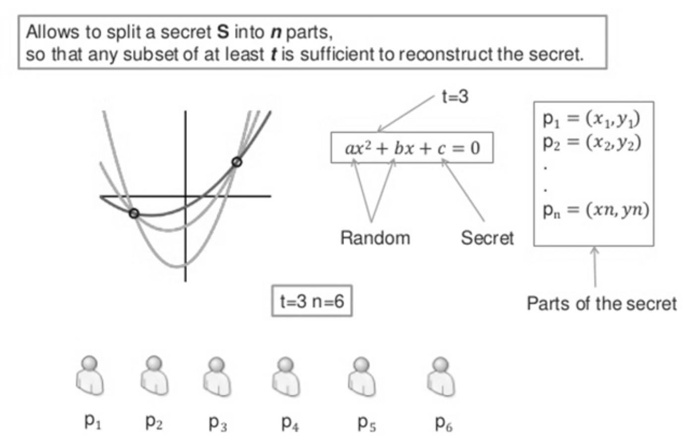

This repo is still in active development

# Sharder

Sharder is a lightweight command-line tool designed to simplify the process of sharding mnemonics. With Sharder, you can effortlessly split your mnemonics into smaller, more manageable chunks, making it easier to organize and store sensitive information securely. Whether you're working with cryptographic keys, passwords, or any other mnemonic-based data, Sharder provides a seamless solution for dividing and distributing your mnemonics across multiple locations. Take control of your mnemonic sharding process with Sharder and ensure the utmost security for your valuable data.

## Main Use Case & Background

The inspiration for this project was simply the question "what would happen to your crypto if you suddenly died?", well the answer is quite clear, you can either trust other people with your keys or your loved ones will lose their crypto.

The shamir secret sharing algorithm is an elegant technique that uses coordinates along a polynomial to encode the secret. 2 properties are defined, a threshold and a total which generate the `shares`. So long as the threshold number of shares are presented back to the application, a secret can be recovered, without disclosing any information of the secret in the shares themselves.

## CLI

[See Here](docs/cryptosharder.md) for CLI documentation
